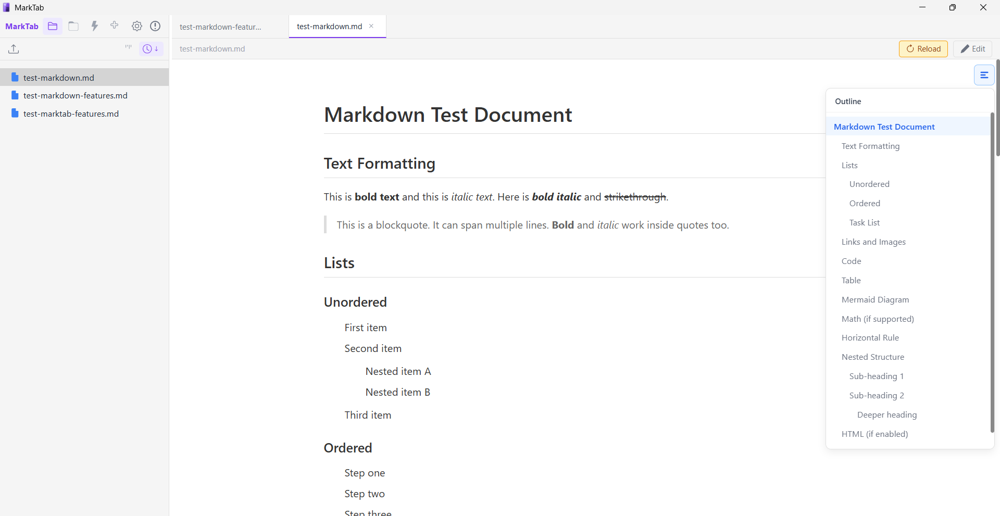

# MarkTab

A lightweight, tabbed Markdown editor for Windows. Built with Tauri v2 + Vue 3 + CodeMirror 6.



## Features

- **Tabbed editing** — Open multiple files in tabs, switch freely
- **Live preview** — Real-time rendered preview with syntax highlighting (highlight.js)
- **Table of Contents** — Auto-generated TOC that follows scroll position
- **Diagram support** — Mermaid and draw.io diagrams rendered inline, click to enlarge
- **Directory tree** — Browse folders with recursive subdirectory support, sort by name or time
- **Image paste** — Paste or drag images directly, auto-saved to `.assets` folder with markdown reference inserted
- **Auto save** — Debounced save with configurable delay
- **Agent-friendly** — Non-dirty tabs silently reload on external changes; dirty tabs show a conflict banner
- **File watcher** — Detects external modifications and file deletion
- **Keyboard shortcuts** — Ctrl+O/W/S/Tab and more
- **Windows file association** — Double-click `.md` files to open in MarkTab
- **Check for updates** — Auto-check on startup, manual check in About dialog
- **About dialog** — App info with GitHub repository link

## Download

Download the latest installer from the [Releases](../../releases) page.

- **MSI installer** — `MarkTab_1.2.1_x64_en-US.msi`
- **Portable EXE** — `marktab.exe` (~15 MB, standalone, no dependencies)

## Development

```bash
# Install dependencies
npm install

# Development
npx tauri dev

# Production build
npx tauri build
```

See [CLAUDE.md](CLAUDE.md) for detailed build instructions and architecture docs.

## Tech Stack

- **Frontend**: Vue 3 + TypeScript + Tailwind CSS v4
- **Editor**: CodeMirror 6 (direct, not via vue-codemirror)
- **Preview**: markdown-it + highlight.js
- **Backend**: Tauri v2 (Rust)
- **Plugins**: fs, dialog, window-state, single-instance, shell

## License

MIT
