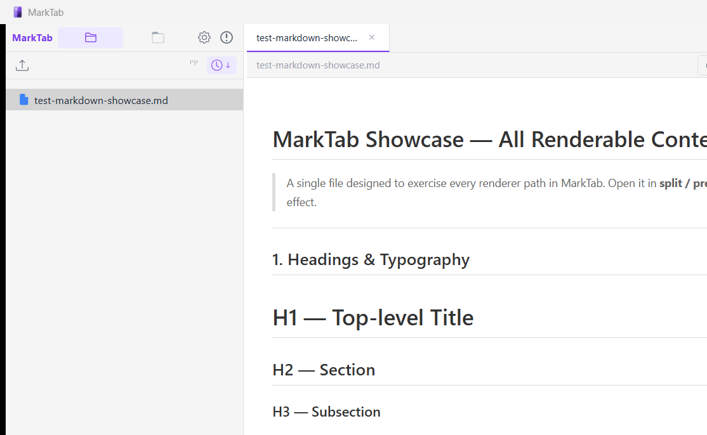
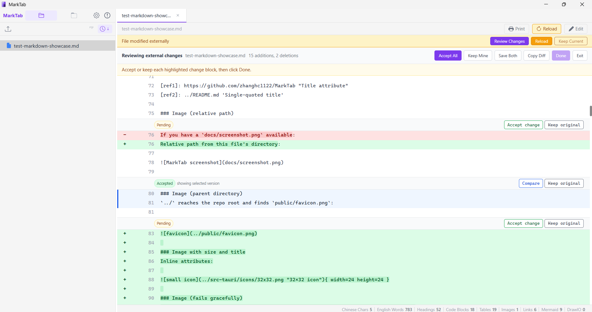

# MarkTab

> A lightweight, tabbed Markdown editor for Windows and macOS. Built with Tauri v2 + Vue 3 + CodeMirror 6.



MarkTab is a **local-file-first**, multi-tab Markdown editor designed to feel faster and more focused than a full IDE, while staying more capable at multi-file writing than a single-document editor. The name comes from "Markdown" + "Tab" — open many files at once, switch freely, and let AI agents or Git safely edit alongside you.

## Highlights

- **Tabbed editing** — open many files, switch freely, dirty state tracked per tab
- **Live preview** — `markdown-it` + `highlight.js`, with a sidebar Table of Contents that follows scroll
- **Mermaid & draw.io diagrams** — rendered inline, click to enlarge
- **Directory tree** — favorite folders, recent folders, recursive subdirectories, sort by name or time
- **Image paste / drag-drop** — saved to a sibling `.assets/` folder, Markdown reference inserted automatically
- **Auto-save** — debounced, configurable delay, with safe shutdown flush
- **Agent-friendly change review** — non-dirty tabs silently reload on external changes; dirty tabs show an inline diff/merge review (accept block, keep mine, save both, copy diff)
- **File watcher** — detects external modification and external deletion
- **Print** — print the current document with embedded images and adjusted font scale
- **Print-ready build** — produces EXE, MSI, and MSIX bundles
- **Keyboard shortcuts** — `Ctrl+O` / `Ctrl+W` / `Ctrl+S` / `Ctrl+Tab` and more
- **OS file association** — double-click `.md` / `.markdown` to open in MarkTab
- **Update check** — auto-check on startup against GitHub Releases, manual check in the About dialog
- **Settings** — auto-save delay, sidebar width, editor mode, font size, line wrapping, line numbers

## Review External Changes

When another tool — an AI agent, Git, a sync client, or a script — edits a file that's currently open in MarkTab, you don't lose your work. Non-dirty tabs silently reload; **dirty tabs open an inline diff/merge review** so you can decide exactly what stays.



The review panel shows every change block with line numbers, additions in green and deletions in red. Decisions are made per block, not all-or-nothing:

| Action | Effect |
|--------|--------|
| **Accept change** | Take the external version for that block |
| **Keep original** | Discard the external edit, keep your version |
| **Compare / Preview** | Toggle side-by-side comparison of the two versions |
| **Accept All** / **Keep Mine** | Apply the decision to every block at once |
| **Save Both** | Write your version to a conflict-copy filename |
| **Copy Diff** | Copy a unified diff to the clipboard for AI or shell tools |
| **Done** | Apply reviewed content back to the editor |

This makes MarkTab safe to leave open while background tools mutate your Markdown — the editor stays the source of truth, but you never have to manually re-apply or rebase.

## Download

Grab the latest installer from the [Releases](../../releases) page.

| Platform | Artifact | Notes |
|----------|----------|-------|
| Windows (x64) | `MarkTab_x.x.x_x64_en-US.msi` | Standard installer |
| Windows (x64) | `marktab.exe` | Portable, ~15 MB, no DLL dependencies |
| Windows (x64) | `MarkTab_x.x.x.0.msixbundle` | Microsoft Store / sideload |
| macOS (Intel) | `.app` / `.dmg` | x86_64 |
| macOS (Apple Silicon) | `.app` | aarch64 (DMG skipped by CI) |

## Quick Start

```bash
# Install dependencies
npm install

# Run the dev server (Vite on :1420 + Tauri shell)
npx tauri dev

# Type check
npm run build

# Production build (EXE + MSI + MSIX on Windows)
npx tauri build
```

> **Build from bash on Windows?** `LIB` and `INCLUDE` need Windows-style backslash paths or `cc-rs` picks up the wrong toolchain. See [`CLAUDE.md`](./CLAUDE.md#starting-tauri-devbuild-from-claude-code-bash) for the exact env-var block.

## Architecture

```
AppConfig (JSON in appDataDir)
  ├── recentFiles    → fileStore (Pinia)
  ├── favoriteDirs,
  │   recentDirs     → directoryStore (Pinia)
  └── preferences    → appConfigStore (Pinia)
        ├── autoSaveDelay, sidebarWidth, editorMode,
        ├── fontSize, lineWrapping, lineNumbers

Active tab content → useAutoSave (debounced) → writeFileContent → disk
External change  → useFileWatcher → ExternalChangeInlineReview
Update check     → useUpdateChecker (GitHub Releases API) → shell.open(releaseUrl)
```

All stores use the **Pinia Composition API** style. Runtime state is serialized back to the JSON config file via `fileStore.persistState()` through `appConfigStore`.

### File opening — three paths, one flow

Every file-opening path converges on the same sequence: `readFileContent` → `addFile` → `openTab`.

1. **Dialog** — `Ctrl+O` or the toolbar → `useFileDialog.openFileFromDialog()` (the single source of truth)
2. **External** — OS file association or CLI arg → Rust `single-instance` plugin → emits `open-file` → `useExternalFileOpen`
3. **File tree** — click a file in the sidebar; an already-open file reuses its tab

### Rust backend

Minimal on purpose. `src-tauri/src/lib.rs` only registers plugins and forwards CLI arguments. All file I/O goes through `tauri-plugin-fs` and `tauri-plugin-dialog` from the frontend. `main.rs` uses `windows_subsystem = "windows"` to suppress the console window in release builds. On first launch the backend sleeps 500 ms before emitting `open-file`, giving the frontend time to mount.

### CodeMirror configuration

Runtime-mutable extensions (theme, line wrapping, line numbers) use the **Compartment** pattern in `MarkdownEditor.vue`. They are reconfigured via `compartment.reconfigure()` on the existing `EditorState` rather than rebuilding the editor.

## Project Layout

```
.
├── src/                       # Vue 3 + TypeScript frontend
│   ├── components/
│   │   ├── editor/            # MarkdownEditor, MarkdownPreview, TabBar, TableOfContents, …
│   │   ├── layout/            # AppLayout, MainPanel, Sidebar
│   │   ├── settings/          # AboutDialog, SettingsDialog, UpdateDialog
│   │   └── sidebar/           # FileTree, DirNode, QuickAccess
│   ├── composables/           # useAutoSave, useFileDialog, useFileWatcher,
│   │                          # useUpdateChecker, useTableOfContents, usePrint, …
│   ├── stores/                # appConfigStore, fileStore, tabStore,
│   │                          # editorStore, directoryStore
│   ├── services/              # markdown, fileIo, config, changeReview
│   └── utils/                 # pathUtils
│
├── src-tauri/                 # Rust backend (Tauri v2)
│   └── src/
│       ├── main.rs            # Windows-subsystem entry point
│       └── lib.rs             # Plugin registration + CLI argument forwarding
│
├── docs/                      # Design and planning docs
├── scripts/                   # Build helpers (e.g. MSIX icon generation)
├── public/                    # Static assets, including privacy.html
└── .github/workflows/         # CI: build.yml (releases), pages.yml (privacy page)
```

## Tech Stack

**Frontend**

- Vue 3 + `<script setup lang="ts">` Composition API
- TypeScript (`strict`, `noUnusedLocals`, `noUnusedParameters`)
- Tailwind CSS v4 via `@tailwindcss/vite`
- Pinia for state management
- Vite dev server on port `1420` (`strictPort: true`)

**Editor**

- CodeMirror 6 directly (no `vue-codemirror` wrapper)
  - `@codemirror/commands`, `@codemirror/lang-markdown`
  - `@codemirror/search`, `@codemirror/state`, `@codemirror/view`

**Preview**

- `markdown-it` + `highlight.js`
- `mermaid` for diagrams
- draw.io for inline SVG diagrams

**Backend**

- Tauri v2 (Rust, edition 2021)
- Plugins: `fs`, `dialog`, `shell`, `window-state`, `single-instance`

## Design

The **A4 Crystalline Edition** is the visual identity — a violet, faceted palette inspired by Obsidian. It blends the structural discipline of the A4 ratio with the depth of a crystal, expressing the idea of "polishing raw thoughts into structured Markdown."

| Facet | Range |
|-------|-------|
| Top | Lavender `#C4B5FD` → `#A78BFA` |
| Right | Violet `#8B5CF6` → `#6D28D9` |
| Left | `#A78BFA` → `#8B5CF6` |
| Bottom | Purple `#4C1D95` → Midnight `#1E1B4B` |
| Hashtag | Solid white with 30 % opacity drop shadow |

See [`docs/design-philosophy.md`](./docs/design-philosophy.md) for the full rationale.

## Configuration

| Setting | Description |
|---------|-------------|
| `autoSaveDelay` | Debounce delay for auto-save (ms) |
| `sidebarWidth` | Sidebar width in px |
| `editorMode` | Editor view mode |
| `fontSize` | Editor font size |
| `lineWrapping` | Soft-wrap long lines |
| `lineNumbers` | Show / hide gutter line numbers |

All preferences live in `appDataDir/marktab-config.json` and are loaded on startup.

## Release Workflow

Cross-platform builds run on GitHub Actions and are triggered by pushing a `v*` tag. The Windows job also produces an MSIX bundle for Microsoft Store submission.

```bash
# 1. Bump version in four places
#    package.json, src-tauri/Cargo.toml, src-tauri/Cargo.lock,
#    src-tauri/tauri.conf.json

# 2. Commit and push
git add -A && git commit -m "release: vx.y.z"
git push github master

# 3. Tag and push
git tag vx.y.z
git push github vx.y.z
```

The release is created as a **draft** — review the assets, then publish.

## Contributing

Issues and pull requests are welcome. For non-trivial changes, please open an issue first to discuss the design — MarkTab intentionally keeps its scope tight (local files, tabs, preview, agent-friendly change review) and may push back on features that drift toward "second Obsidian / Notion" territory.

Helpful starting points:

- [`CLAUDE.md`](./CLAUDE.md) — build environment quirks, architecture notes, release workflow
- [`docs/feature-list.md`](./docs/feature-list.md) — current feature inventory and roadmap
- [`docs/marktab-user-optimization-plan.md`](./docs/marktab-user-optimization-plan.md) — product roadmap from the user's perspective
- [`docs/app-issues-robustness-review.md`](./docs/app-issues-robustness-review.md) — known issues and risk audit

## Privacy

MarkTab is fully local. It does not collect or transmit user data. The only outbound request is the optional GitHub Releases check for updates.

- Privacy policy: <https://zhanghc1122.github.io/MarkTab/>
- Source: [`public/privacy.html`](./public/privacy.html)

## License

MIT
