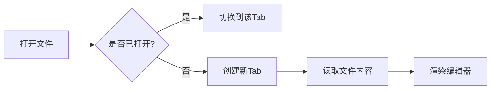

# MarkTab 功能测试文档

## 基础格式

**粗体** *斜体* ~~删除线~~ `行内代码`

> 引用文本：这是一段引用内容
> 第二行引用

---

## 列表

### 无序列表

- 第一项
- 第二项
  - 嵌套项 A
  - 嵌套项 B
- 第三项

### 有序列表

1. 步骤一
2. 步骤二
3. 步骤三

### 任务列表

- [x] 已完成任务
- [ ] 待完成任务
- [ ] 另一个待完成

## 链接与图片

[GitHub](https://github.com)


## 代码块

```javascript
function hello(name) {
  console.log(`Hello, ${name}!`);
  return { greeting: `Hi ${name}`, time: Date.now() };
}
```

```python
def fibonacci(n):
    if n <= 1:
        return n
    return fibonacci(n - 1) + fibonacci(n - 2)
```

## 表格

| 功能 | 状态 | 说明 |
|------|------|------|
| 编辑 | ✅ | CodeMirror 6 |
| 预览 | ✅ | markdown-it |
| 排序 | ✅ | 统一排序 |
| 持久化 | ✅ | 配置保存 |

## Mermaid 图表



## 数学公式

行内公式 $E = mc^2$ 和块级公式：

$$
\sum_{i=1}^{n} x_i = x_1 + x_2 + \cdots + x_n
$$

## 分割线

---

## 嵌套引用

> 外层引用
>
> > 内层引用
>
> 回到外层

## HTML 标签

<details>
<summary>点击展开详情</summary>

这是折叠的内容区域。

</details>

## 脚注

这是一段带脚注的文本[^1]，还有另一个脚注[^2]。

[^1]: 脚注一的内容
[^2]: 脚注二的内容
